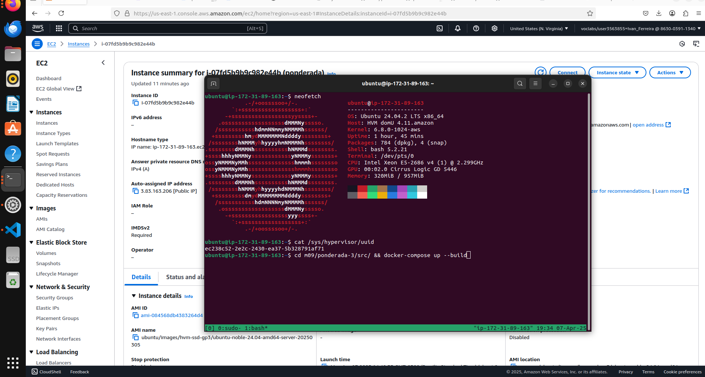

# Aplicação Web Modularizada

## Visão Geral

Aplicação web modular usando containers com configuração segura, desenvolvida com React, GoLang/Gin, PostgreSQL e Nginx.

Acesse a aplicação em um ec2 da aws: http://ec2-3-83-163-206.compute-1.amazonaws.com:80

Caso não esteja mais disponível no link acima, assista ao vídeo da aplicação funcionando em um ec2 da aws: https://drive.google.com/file/d/1hTiGV2ZwRFvhQvy8uiRqOIUBEwqhPnlv/view?usp=sharing

Funcionalidades:
- Gerenciamento de Usuários: Cadastro, autenticação, listagem, edição e exclusão
- Gerenciamento de Produtos: Cadastro, listagem, edição e exclusão
- Armazenamento de Imagens: Soluções para armazenar fotos de perfil de usuários e imagens de produtos

### Tecnologias utilizadas
- Frontend: React
- Backend: GoLang com framework Gin
- Banco de Dados: PostgreSQL
- Servidor Web: Nginx
- Containerização: Docker

## Como executar
1. Clone este repositório

    `$ git clone https://github.com/ifferreira/m09 && cd m09/ponderada-3/src`
2. Execute o docker para inicializar a aplicação
 
    `$ docker compose up --build`
3. Acesse http://localhost:80 no navegador

